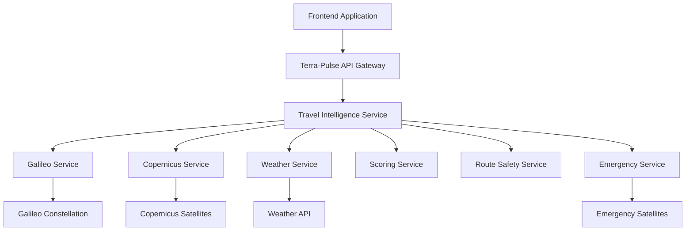
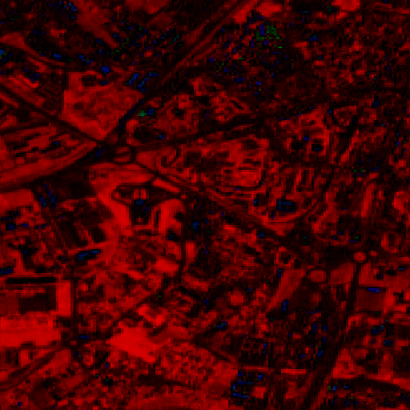
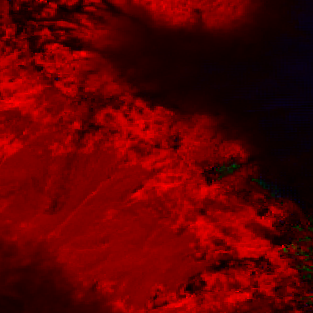
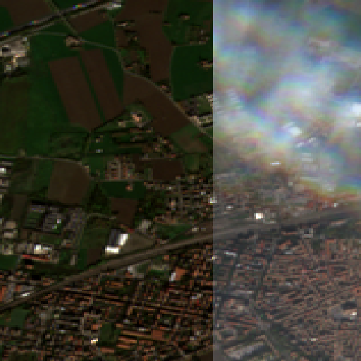
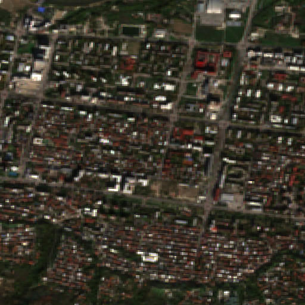
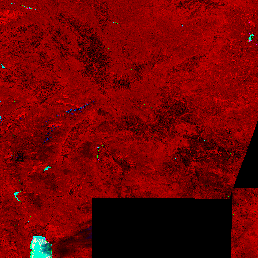

# 🌍 Terra-Pulse: Intelligent Travel Safety & Planning System

[Intro](/screenshots/introduction.png)

Terra-Pulse is an advanced travel intelligence system that combines satellite positioning, Earth observation data, weather analysis, and AI-powered safety assessments to provide comprehensive travel planning and emergency services.

**Best Route To Travel Experience**

## 🚨 Problem Statement

Modern travelers face significant safety challenges when exploring remote or unfamiliar destinations:

- **Limited real-time environmental data** about destination conditions
- **Lack of comprehensive safety assessment** combining multiple data sources  
- **Poor emergency communication** in remote areas without cellular coverage
- **Insufficient route planning tools** that consider environmental hazards
- **No unified platform** integrating satellite positioning, weather, and safety data

### The Challenge

Traditional travel planning relies on outdated information and doesn't account for real-time environmental conditions, GPS accuracy limitations, or emergency communication needs in remote locations.

## ✨ Solution Overview

Terra-Pulse addresses these challenges through:

### 🛰️ **Multi-Satellite Intelligence**

- **Galileo Positioning**: High-precision GPS with accuracy metrics
- **Copernicus Earth Observation**: Real-time satellite imagery analysis
- **Emergency Satellite Communication**: Offline distress signal capability

### 🧠 **AI-Powered Safety Analysis**

- **Destination Health Scoring**: 0-100 scale combining environmental factors
- **Route Safety Assessment**: Multi-point safety analysis along travel routes
- **Dynamic Risk Evaluation**: Real-time risk level classification

### 🌍 **Comprehensive Data Integration**

- **Environmental Indices**: Vegetation, water, snow coverage analysis
- **Weather Intelligence**: Real-time conditions and forecasts
- **Air Quality Monitoring**: PM2.5, PM10 pollution levels
- **GPS Reliability Assessment**: Satellite availability and accuracy

## 🏗️ System Architecture

### Core Services Architecture



### Technology Stack

- **Backend**: Laravel 12.x (PHP 8.3+)
- **Testing**: Pest v4 with Browser Testing
- **Code Quality**: Laravel Pint
- **Frontend**: Tailwind CSS v4
- **Database**: SQLite (development)
- **APIs**: RESTful with JSON responses

## 🚀 Key Features

### 1. **Destination Health Analysis**

- Real-time environmental condition assessment
- Multi-factor safety scoring (0-100 scale)
- Satellite imagery with AI analysis
- Weather integration with air quality data

### 2. **Route Planning & Safety**

- Multi-point route safety analysis
- GPS accuracy assessment along routes
- Travel mode optimization (walking, cycling, driving)
- Alternative route suggestions

### 3. **Emergency Satellite Communication**

- Offline emergency beacon activation
- Multi-satellite distress signal transmission
- Automatic rescue coordination
- GPS tracking for emergency response

### 4. **Travel Intelligence Dashboard**

- Real-time destination health monitoring
- Safety recommendations and equipment suggestions  
- Best travel time optimization
- Risk level classification and alerts

## 🔧 API Integration Guide

#### 1. Destination Health Analysis

```http
GET /destination/health?lat={latitude}&lng={longitude}
```

**Example Request:**

```bash
curl "http://cassiehackathon.test/destination/health?lat=42.405&lng=19.815"
```

**Response Structure:**

```json
{
    "position_info": {
        "latitude": 42.405,
        "longitude": 19.815,
        "altitude": 96,
        "accuracy": 4.74,
        "satellite_count": 11
    },
    "surface_indices": {
        "vegetation_index": 0.75,
        "water_index": 0.1,
        "snow_index": 0.05
    },
    "weather_snapshot": {
        "location": {},
        "temperature": 16.1,
        "condition": "Partly cloudy",
        "uv": 0.5,
        "precip_mm": 0,
        "humidity": 82,
        "cloud_cover": 50,
        "visibility_km": 10,
        "wind_kph": 5,
        "wind_dir": "NNE",
        "air_quality": {
            "pm2_5": 3.95,
            "pm10": 4.35
        },
        "last_updated": "2025-11-09 11:15"
    },
    "destination_health_score": 74.25,
    "health_components": {
        "vegetation_contribution": 37.5,
        "water_contribution": -3,
        "snow_contribution": -1,
        "precip_contribution": 0,
        "visibility_contribution": 15,
        "air_quality_contribution": 0,
        "uv_extreme_contribution": 0,
        "night_travel_contribution": 0
    },
    "route_safety_rating": "HIGH",
    "safety_recommendations": {
        "risk_level": "LOW",
        "recommendations": [
            "Good conditions for travel and outdoor activities",
            "Safe conditions - enjoy your activities",
            "Carry emergency communication device",
            "Check local weather forecast before departure",
            "Inform someone of your travel plans"
        ],
        "priority_alerts": [],
        "equipment_suggestions": [
            "GPS device or smartphone with offline maps",
            "First aid kit"
        ],
        "best_travel_times": [
            "Early morning or late afternoon for best visibility"
        ]
    },
    "image_url": "http://cassiehackathon.test/storage/copernicus/copernicus_1762684101.png",
    "url_analizer": "http://cassiehackathon.test/storage/copernicus/copernicus_1762684103.png",
    "timestamp": "2025-11-09T10:28:24+00:00",
    "valid_until": "2025-11-11T10:28:24+00:00",
    "bbox": [
        19.805,
        42.415,
        19.825000000000003,
        42.395
    ]
}
```

#### 2. Route Safety Analysis

```http
GET /route/analyze?origin_lat={lat}&origin_lng={lng}&dest_lat={lat}&dest_lng={lng}&travel_mode={mode}
```
<!-- some sample image -->
### Satelite Imagery Examples

```json
{
    "lat": 42.40503460923687,
    "lng": 19.815049215865674,
    "image_url": "http://cassiehackathon.test/storage/copernicus/copernicus_1762685590.png",
    "legend": {
        "red": "NDVI (Vegetation)",
        "green": "NDWI (Water)",
        "blue": "NDSI (Snow)"
    }
}
```

**Sample Mail**













#### 3. Emergency Services

```http
POST /emergency/activate
Content-Type: application/json

{
  "lat": 42.405,
  "lng": 19.815,
  "emergency_type": "MEDICAL",
  "message": "Emergency description",
  "user_info": {
    "name": "John Doe",
    "phone": "+1234567890"
  }
}
```

### Complete API Reference

| Endpoint | Method | Description |
|----------|--------|-------------|
| `/destination/health` | GET | Comprehensive destination analysis |
| `/route/analyze` | GET | Route safety and planning |
| `/route/quick-check` | GET | Quick location safety check |
| `/emergency/activate` | POST | Emergency beacon activation |
| `/emergency/status` | GET | Emergency tracking |
| `/copernicus/analyze` | GET | Satellite imagery analysis |
| `/satellite/analyze` | GET | Surface indices analysis |

## 📊 Data Sources & Integrations

### Satellite Data Sources

- **Galileo**: European Global Navigation Satellite System [Doc](https://docs.galileo-ft.com/pro/reference/program-api-intro)
- **Copernicus**: EU Earth Observation Programme [Doc](https://documentation.dataspace.copernicus.eu/APIs/SentinelHub/ApiReference.html#tag/batch_process/operation/getAllBatchProcessRequests)
- **COSPAS-SARSAT**: International Search and Rescue Satellite System

### External APIs

- **WeatherAPI**: Real-time weather and air quality data [Doc](https://www.weatherapi.com/api-explorer.aspx)
- **Amadeus**: Hotel and transfer booking services [Doc](https://developers.amadeus.com/self-service/category/hotels/api-doc/hotel-booking)
- **Emergency Services**: Rescue coordination centers

### Data Processing

- **NDVI**: Normalized Difference Vegetation Index
- **NDWI**: Normalized Difference Water Index  
- **NDSI**: Normalized Difference Snow Index
- **GPS Accuracy**: Dilution of Precision calculations

## 🛠️ Development Setup

### Prerequisites

- PHP 8.3+ with extensions: `curl`, `gd`, `mbstring`, `sqlite3`
- Composer 2.0+
- Node.js 18+ & NPM
- Git

### Installation

1. **Clone Repository**

```bash
git clone https://github.com/your-org/terra-pulse.git
cd terra-pulse
```

2. **Install Dependencies**

```bash
composer install
npm install
```

3. **Environment Configuration**

```bash
cp .env.example .env
php artisan key:generate
```

4. **Configure Services**

```env
# Weather API
WEATHER_API_KEY=your_weather_api_key

# Copernicus/Amadeus APIs
COPERNICUS_CLIENT_ID=your_client_id
COPERNICUS_CLIENT_SECRET=your_client_secret
AMADEUS_API_KEY=your_amadeus_key
```

5. **Database Setup**

```bash
php artisan migrate
php artisan db:seed
```

6. **Storage Setup**

```bash
php artisan storage:link
mkdir -p storage/app/public/copernicus
```

7. **Start Development**

```bash
composer run dev
# or separately:
# php artisan serve
# npm run dev
```

### Testing

```bash
# Run all tests
php artisan test

# Run specific test files
php artisan test tests/Feature/TravelIntelligenceTest.php

# Run with coverage
php artisan test --coverage

# Browser testing
php artisan test tests/Browser/
```

### Code Quality

```bash
# Format code
vendor/bin/pint

# Check formatting
vendor/bin/pint --test
```

## 🔒 Security Considerations

### Emergency Services

- Emergency beacon activation is logged for accountability
- GPS coordinates are encrypted during transmission
- Multi-satellite redundancy prevents single points of failure

### API Security

- Rate limiting implemented on all endpoints
- Input validation and sanitization
- HTTPS required for production deployments
- API key authentication for external services

### Data Privacy

- Location data is not permanently stored
- User information in emergency calls follows GDPR compliance
- Satellite imagery is processed without storing personal data

## 📈 Performance & Scalability

### Optimization Features

- **Response Caching**: 48-hour validity for destination data
- **Image Processing**: Optimized satellite image handling
- **Database Queries**: Eloquent with eager loading
- **API Rate Limiting**: Prevents service abuse

### Monitoring & Logging

- Comprehensive service logging with Laravel Log
- API response time monitoring  
- Satellite service availability tracking
- Emergency response coordination logging

## 🌟 Use Cases

### Adventure Tourism

- **Mountain Hiking**: Snow conditions, GPS reliability, emergency preparedness
- **Remote Camping**: Environmental hazards, weather forecasting, safety equipment
- **Marine Activities**: Coastal conditions, emergency communication at sea

### Professional Applications

- **Emergency Services**: Rescue coordination and resource allocation
- **Logistics**: Route safety for cargo transportation
- **Scientific Expeditions**: Environmental monitoring and safety protocols

### Urban Planning

- **Infrastructure Development**: Environmental impact assessment
- **Tourism Planning**: Destination safety and accessibility analysis
- **Emergency Preparedness**: Risk assessment and response planning

## 🗺️ Roadmap

### Phase 1: Core Platform ✅

- ✅ Satellite positioning integration
- ✅ Environmental data processing
- ✅ Basic safety scoring
- ✅ Emergency communication system

### Phase 2: Advanced Features 🚧

- 🔄 Machine learning risk prediction
- 🔄 Real-time weather alerts  
- 🔄 Mobile app development
- 🔄 Offline map caching

### Phase 3: Enterprise Features 📋

- 📋 Multi-user dashboard
- 📋 Fleet tracking capabilities
- 📋 Integration with rescue services
- 📋 Historical data analytics

## 🤝 Contributing

### Development Guidelines

1. Follow Laravel coding standards and use Laravel Pint
2. Write comprehensive tests using Pest
3. Use conventional commit messages
4. Update documentation for new features

### Pull Request Process

1. Create feature branch from `main`
2. Write tests for new functionality
3. Ensure all tests pass: `php artisan test`
4. Format code: `vendor/bin/pint`  
5. Submit PR with detailed description

### Testing Requirements

- Unit tests for all services and actions
- Feature tests for API endpoints
- Browser tests for critical user flows
- Minimum 80% code coverage

## 📄 License

This project is licensed under the MIT License - see the [LICENSE](LICENSE) file for details.

## 🆘 Support & Documentation

### Getting Help

- **Issues**: [GitHub Issues](https://github.com/your-org/terra-pulse/issues)
- **Discussions**: [GitHub Discussions](https://github.com/your-org/terra-pulse/discussions)
- **Documentation**: [API Documentation](API.md)

### Emergency Support

For emergency-related issues with the satellite communication system:

- **Emergency Hotline**: +1-800-EMERGENCY
- **Technical Support**: <support@terra-pulse.com>

### Resources

- [Complete API Documentation](API.md)
- [Frontend Integration Guide](docs/frontend-guide.md)  
- [Emergency Services Manual](docs/emergency-guide.md)
- [Satellite Data Processing](docs/satellite-guide.md)

---

**Built with ❤️ for safer travel and exploration**

*Terra-Pulse: Empowering travelers with satellite intelligence and emergency safety systems.*
